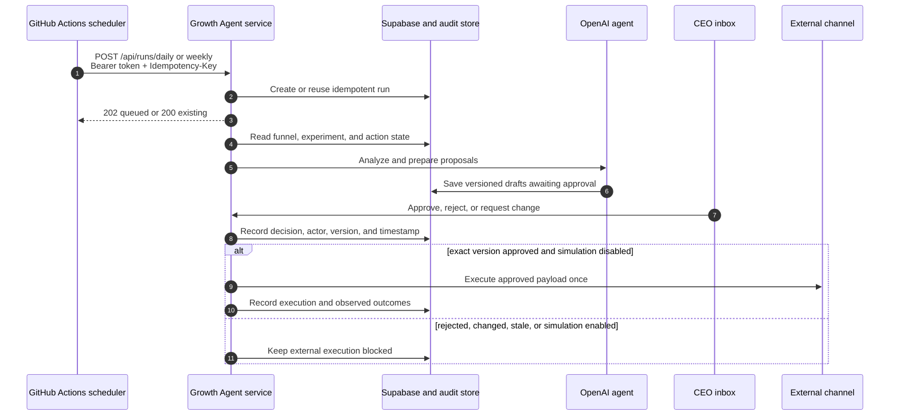

# ANCBuddy Growth Agent operations

This is the production contract for the Growth Agent scheduler, service, approval inbox, and audit trail. The system may research, analyze, prioritize, and draft on its own. It must not create an externally visible effect without a version-specific CEO approval.

## Architecture and request sequence



GitHub Actions is only a scheduler. Its scoped bearer token can enqueue analysis runs; it cannot read the dashboard or approve actions. Supabase remains the source for funnel and attribution data and the durable store for runs, actions, decisions, executions, and observations.

## Deployment contract

The existing GitHub Pages workflow continues to deploy the public website only; it cannot host this Python service. Deploy `growth-agent/` to the VPS as one HTTPS service with persistent access to its production data store. Run exactly one service replica until run serialization uses a distributed lock; the current process lock serializes work only inside one replica. Start it from the `growth-agent/` directory with:

```bash
uv run python main.py
```

The process listens on `0.0.0.0:$PORT`. The platform must terminate TLS, preserve the client-facing HTTPS origin in `PUBLIC_BASE_URL`, restart failed processes, and retain the configured production store across deploys. Set `SCHEDULER_ENABLED=false` and do not add a platform cron: `.github/workflows/growth-agent-schedule.yml` is the sole scheduler.

Required HTTP behavior:

| Endpoint | Authentication | Contract |
| --- | --- | --- |
| `GET /health` | Public | Return `200` with service and store readiness. Never expose secrets. |
| `POST /api/runs/daily` | Scoped scheduler token or CEO session | Queue a daily observation run. |
| `POST /api/runs/weekly` | Scoped scheduler token or CEO session | Queue the weekly strategy run. |
| `POST /api/runs/manual` | Scoped scheduler token or CEO session | Queue a manually requested run. |
| `POST /api/auth/login` | Password | Create the `HttpOnly` CEO session cookie. |
| `GET /api/dashboard` | CEO session or CEO API token | Return the approval inbox and summary. |
| `POST /api/actions/{id}/decisions` | CEO session or CEO API token | Apply `approve`, `reject`, or `change` with `expected_version`. |

Run requests accept `{ "trigger": "github_actions" }` and an `Idempotency-Key` header. A new run returns `202`; a duplicate key returns the existing run with `200` and must not invoke the agent twice. A non-`200`/`202` response makes the workflow fail. Response bodies are deliberately not printed in GitHub logs. A green workflow confirms enqueueing, not completion; completion and agent failures belong in the dashboard and service audit log.

`GET /health` should report `status`, `service`, `store`, `agent_ready`, and `execution_mode`. Before enabling the scheduler, require `status=ok`, `store=supabase`, `agent_ready=true`, and `execution_mode=simulation`. Prefer a same-origin reverse proxy for the CEO inbox and API. If they use different origins, the API allows credentialed CORS only for the exact `CEO_ORIGIN`; never combine cookies with `Access-Control-Allow-Origin: *`. Keep both HTTPS origins on the same site, for example `https://ancbuddy.com` and `https://agent.ancbuddy.com`, so the host-only, `HttpOnly`, `SameSite=Strict`, `Secure` CEO cookie is sent. A truly cross-site API is outside the current contract; it would require a reviewed `SameSite=None; Secure` change and remains subject to third-party-cookie blocking.

### Runtime secrets and configuration

Configure service values in the hosting platform, never in Git or build logs:

| Name | Purpose |
| --- | --- |
| `APP_ENV=production` | Enforce production-only validation. |
| `OPENAI_API_KEY` | Agent reasoning and drafting. |
| `BLOCKED_CHANNELS=reddit` | Comma-separated hard blocklist applied in both the agent prompt and deterministic proposal policy. Reddit matching includes `subreddit` and `r/...`. |
| `CEO_PASSWORD_HASH` | Preferred Argon2 hash for CEO browser login. Do not use a plaintext production password. |
| `CEO_API_TOKEN` | Optional long random token for CEO API access. Never give it to the scheduler. |
| `SCHEDULER_API_TOKEN` | Separate long random token accepted only by the run endpoints. |
| `SESSION_SECRET` | Long random secret used to protect CEO sessions. |
| `PUBLIC_BASE_URL` | Canonical HTTPS URL of the deployed service. |
| `CEO_ORIGIN` | Exact HTTPS origin of the CEO inbox; no wildcard or path. |
| `PORT` | Port exposed by the hosting platform. |
| `COOKIE_SECURE=true` | Send the CEO session cookie only over HTTPS. |
| `STORE_BACKEND=supabase` | Require durable production persistence. |
| `SUPABASE_URL` | Supabase project origin used by the agent store. |
| `SUPABASE_SERVICE_ROLE_KEY` | Server-only database credential; never expose it to a browser. |
| `EXECUTION_MODE=simulation` | Hard-block every outbound adapter during initial rollout. |
| `SCHEDULER_ENABLED=false` | Disable the service's optional in-process scheduler. |

Use a separate least-privilege database credential when the data layer supports it. Do not put customer email addresses, raw event payloads, API responses, or secret values in GitHub logs.

Leave outbound integration credentials unset during the simulation period. Later, enable one adapter at a time: `SMTP_*` for approved email, a fine-grained `GITHUB_TOKEN` plus `GITHUB_REPOSITORY` for approved website pull requests, or `GROWTH_WEBHOOK_*` for an explicitly reviewed integration. Credentials make an adapter available; they never authorize an action by themselves.

Keep `reddit` in `BLOCKED_CHANNELS` while the Reddit account is suspended. The service discards any
proposal that references Reddit, a subreddit, or an `r/...` destination before it reaches the CEO
inbox. The agent must not suggest alternate accounts or other suspension workarounds.

Configure these GitHub repository Actions secrets:

| Repository secret | Value |
| --- | --- |
| `GROWTH_AGENT_BASE_URL` | The service's public HTTPS origin, with no endpoint path. |
| `GROWTH_AGENT_API_TOKEN` | The same random value as the service's scoped `SCHEDULER_API_TOKEN`. |

Also configure the GitHub Actions repository variable `GROWTH_AGENT_PUBLIC_URL` with the service's
public HTTPS origin, for example `https://agent.ancbuddy.com`. The Pages workflow injects this as
`VITE_GROWTH_AGENT_API_URL` when it builds the CEO inbox. This URL is configuration, not a
credential; no bearer or database secret belongs in a `VITE_*` value.

The workflow runs the daily observation pass Tuesday through Sunday at `05:15 UTC`; the weekly strategy pass replaces it on Monday at `06:15 UTC`. `workflow_dispatch` can enqueue `daily`, `weekly`, or `manual`. All invocations share one non-cancelling concurrency group, and the single service replica serializes queued runs.

## Simulation-first rollout

1. **Configure and verify:** deploy the service, set runtime secrets, configure the two GitHub secrets, and confirm every protected API endpoint rejects unauthenticated requests. After the workflow is on the repository's default branch, manually dispatch one daily run; scheduled workflows run only from that branch.
2. **Run two weeks in simulation:** keep `EXECUTION_MODE=simulation`. Allow real analytics reads, agent calls, proposals, CEO decisions, and audit writes. Verify that no email, post, listing, purchase, merge, or publish adapter is called.
3. **Review the evidence:** check duplicate suppression, proposal quality, attribution keys, API cost, rejection learning, PII handling, and stale-version protection. Reconcile every attempted execution with its approval record.
4. **Enable one channel at a time:** set `EXECUTION_MODE=live` only after email, listings, and website pull-request adapters pass a dry-run and a single approved canary. Keep unconfigured channels unavailable; an integration credential alone never counts as approval.
5. **Rollback safely:** restore `EXECUTION_MODE=simulation` before investigating unexpected behavior. Rotating `SCHEDULER_API_TOKEN` immediately stops future scheduled calls until the matching GitHub secret is updated.

Simulation affects execution only: scheduled analysis, drafting, approvals, and audit records remain realistic so the two-week review is meaningful. An approval in simulation records the approved version and a `simulation_blocked` audit event, but never calls an adapter.

## Approval and audit boundaries

The agent may autonomously read approved data sources, research public information, analyze the funnel, rank experiments, draft content, and create internal proposals. It may not autonomously:

- send email or messages;
- publish posts, comments, listings, videos, or website changes;
- merge pull requests or trigger production releases;
- spend money, accept commercial terms, or alter pricing;
- approve its own proposal or broaden a prior approval.

An approval is valid only for the recorded action ID, version, channel, target, and payload. `expected_version` prevents a stale browser tab from approving changed content. Any content or recipient change creates a new version and returns the action to `awaiting_approval`. Rejections and change requests are learning signals, not permission to execute a revised draft.

Every state transition must record the action and run IDs, old and new state, content version, actor, timestamp, and relevant result metadata. Execution must be idempotent, and an action must never have more than one successful external execution for the same approved version. Audit records are append-oriented; corrections are new events rather than silent rewrites.

## Operational checks

- **Every day:** the scheduled workflow is green, `/health` is healthy, and no action bypassed `awaiting_approval`.
- **Every week:** reconcile funnel attribution and executed actions, inspect failures and costs, and confirm the open CEO queue remains at five decisions or fewer.
- **On scheduler authentication failure:** rotate `SCHEDULER_API_TOKEN`, update the service and GitHub secret, then manually dispatch one daily run.
- **On repeated server errors:** leave failed runs visible, keep execution in simulation, and inspect service logs without copying response bodies into GitHub issues.
- **Before enabling an adapter:** test missing approval, stale version, duplicate delivery, timeout after delivery, unsubscribe/negative response, and secret-redaction behavior.
