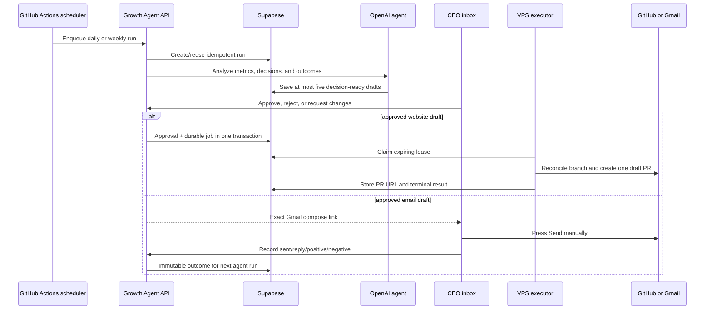

# ANCBuddy Growth Agent operations

This is the production contract for the scheduler, CEO inbox, durable executor, and feedback loop. The agent may research, analyze, rank, and draft. It cannot approve itself, send email, merge a pull request, publish, or spend money.

## Runtime flow

GitHub Actions is only a scheduler. It cannot read the dashboard or approve work. The executor reads only durable jobs; it never scans or replays approvals.

## Production endpoints

| Endpoint | Authentication | Purpose |
| --- | --- | --- |
| `GET /health` | Public | Store, agent, execution mode, and executor liveness/readiness. No secrets. |
| `POST /api/auth/login` | CEO password or temporary code | Create the secure CEO session. |
| `GET /api/dashboard` | CEO | Approval inbox, execution state, goal, and metrics. |
| `POST /api/runs/daily|weekly|manual` | Scheduler or CEO | Create/reuse an idempotent analysis run. |
| `POST /api/actions/{id}/decisions` | CEO | Approve, reject, or request changes for one exact version. |
| `GET|PUT|DELETE /api/integrations/github` | CEO | Inspect, validate/store, or safely remove the encrypted PAT. |
| `POST /api/integrations/github/enable` | CEO | Enable one-PR `canary` or ongoing `live` draft-PR mode. |
| `GET /api/executions/{job_id}` | CEO | Durable job status and confirmed draft-PR URL. |
| `POST /api/actions/{id}/manual-outcomes` | CEO | Record `sent`, `reply`, `positive`, or `negative` for manual email. |

The API allows credentialed CORS only from the exact `CEO_ORIGIN`. Validation responses redact rejected raw inputs, so passwords and PATs are never reflected.

## Required VPS configuration

Secrets belong in root-owned `/etc/ancbuddy-growth-agent.env` (mode `0600`), never Git or browser `VITE_*` values.

| Name | Purpose |
| --- | --- |
| `APP_ENV=production` | Enforce production safeguards. |
| `OPENAI_API_KEY` | Agent analysis and public research. |
| `BLOCKED_CHANNELS=reddit` | Deterministic channel block plus prompt constraint. |
| `CEO_PASSWORD_HASH` | Argon2 browser-login secret. |
| `CEO_API_TOKEN`, `CEO_API_TOKEN_EXPIRES_AT` | Optional temporary mobile code with hard expiry. |
| `SCHEDULER_API_TOKEN` | Run-only GitHub Actions credential. |
| `SESSION_SECRET` | Signed CEO sessions. |
| `PUBLIC_BASE_URL`, `CEO_ORIGIN` | Exact HTTPS API and website origins. |
| `STORE_BACKEND=supabase` | Durable production store. |
| `SUPABASE_URL`, `SUPABASE_SERVICE_ROLE_KEY` | Server-only database access. |
| `INTEGRATION_ENCRYPTION_KEY` | 32-byte key for AES-256-GCM credential envelopes. |
| `GITHUB_REPOSITORY=denizaytac/ancbuddy-site` | Only allowed repository. |
| `EXECUTION_MODE=simulation|live` | Global draft-PR worker gate. |
| `SCHEDULER_ENABLED=false` | GitHub Actions remains the only scheduler. |

The GitHub fine-grained PAT is entered only in the CEO inbox and must target this repository with Metadata read, Contents read/write, and Pull requests read/write. It is encrypted before Supabase storage and never returned by GET.

## Scheduling

The repository workflow runs:

- daily Tuesday through Sunday at `05:15 UTC`;
- weekly Monday at `06:15 UTC`.

Repository secrets `GROWTH_AGENT_BASE_URL` and `GROWTH_AGENT_API_TOKEN` authenticate enqueue requests. Repository variable `GROWTH_AGENT_PUBLIC_URL` supplies the public API origin to the Pages build.

## Rollout and rollback

1. Apply the database migration while the runtime remains in simulation.
2. Deploy the API and verify `/health`, protected endpoints, RLS, and executor liveness.
3. Switch global runtime and DB execution flags to live. This alone authorizes nothing.
4. In the CEO inbox, save/test the repo-scoped PAT and enable the one-PR canary.
5. Create a fresh Product Hunt action under `docs/growth/product-hunt/**`; old simulation approvals remain closed and have no jobs.
6. CEO approves the exact displayed files. Verify exactly one draft PR, no merge, no Pages publish, and automatic integration pause.
7. CEO may explicitly enable future approved draft PRs. Every new PR still requires a fresh exact-version approval.

Rollback: pause/remove the GitHub integration first, then restore `EXECUTION_MODE=simulation` and DB execution flags. Removal cancels queued jobs and refuses while a call is in flight, avoiding an untracked partial result.

## Operational checks

- `/health` must be `200`, `store=supabase`, `executor_alive=true`, and `executor_ready=true`.
- A queued/running action must progress or expose a clear failed/unknown state; the worker catches transient DB errors and retries instead of silently dying.
- A failed or unknown GitHub result pauses the provider. Reconcile the deterministic branch/PR before enabling it again.
- The CEO must see the complete paths and text of every proposed PR file before approval.
- Gmail compose is shown only before `sent` is recorded, preventing accidental duplicate sends.
- Outcomes and CEO feedback must appear in the next agent context; rejected work never becomes future authorization.
